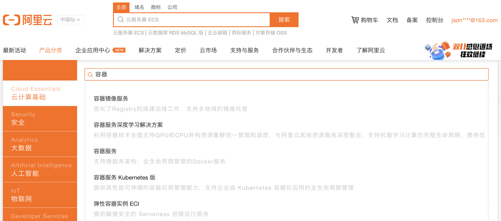
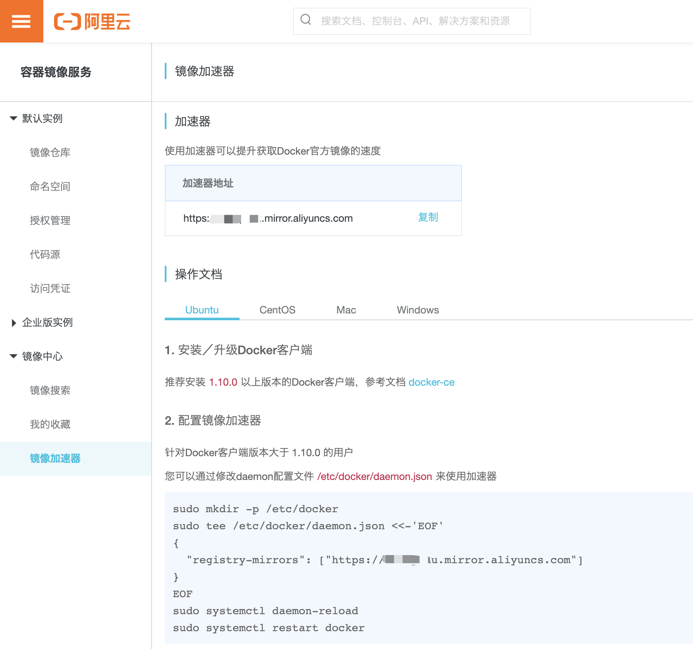

# Docker 学习笔记 - 使用镜像加速器

## 一、为什么要使用加速器

由于不可描述的原因，国内下载镜像速度很慢，使用加速器可以提升获取 docker 镜像的速度。

国内有很多 docker 镜像平台，本文演示如何使用阿里云镜像加速器。

## 二、使用加速器

打开阿里云官网，点击"产品分类"，搜索"容器镜像服务"

点击左边的"镜像加速器"，选择操作系统，根据操作文档设置即可

配置成功，体验飞一般的感觉吧！